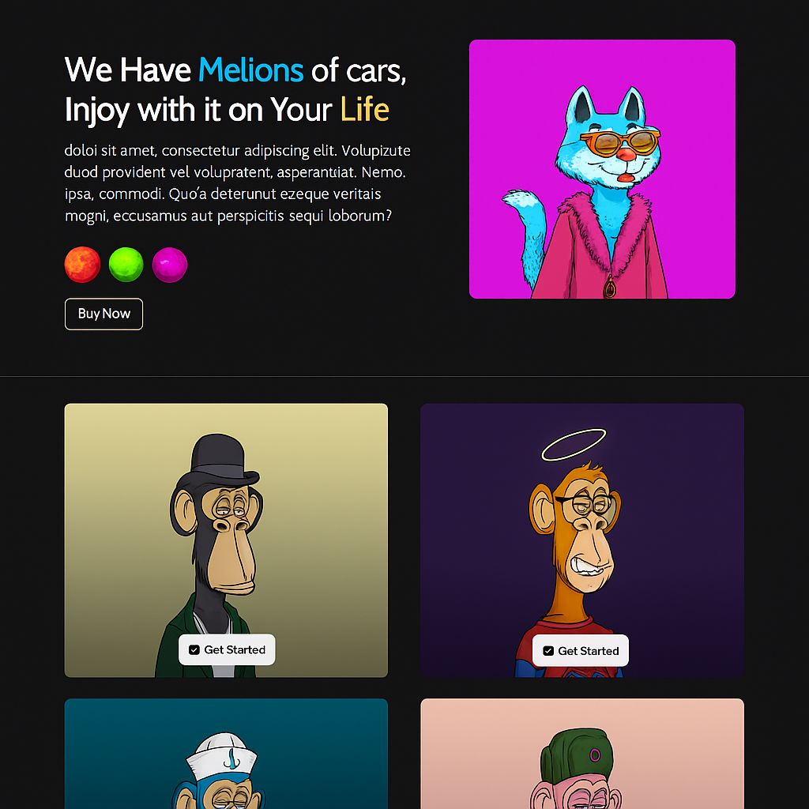

🌐 *My Website*

This is a personal experimental website developed using *HTML*, *CSS*, and *JavaScript*.  
It aims to showcase my Front-End design skills and the use of libraries like *GSAP* to enhance the user experience.

---

📸 *Preview*



> *Illustrative screenshot of the website*

---

🚀 *Features*

- GSAP animations on scroll  
- Well-organized pages and sections  
- Clean and easily editable code  

---

🛠️ *Technologies Used*

- HTML5  
- CSS3 / Flexbox  
- JavaScript ES6  
- GSAP (GreenSock)

---

📁 *How to Run*

1. Download the files or clone the project:
   ```bash
   https://github.com/y9666747-hue/first-project.git
   ```
